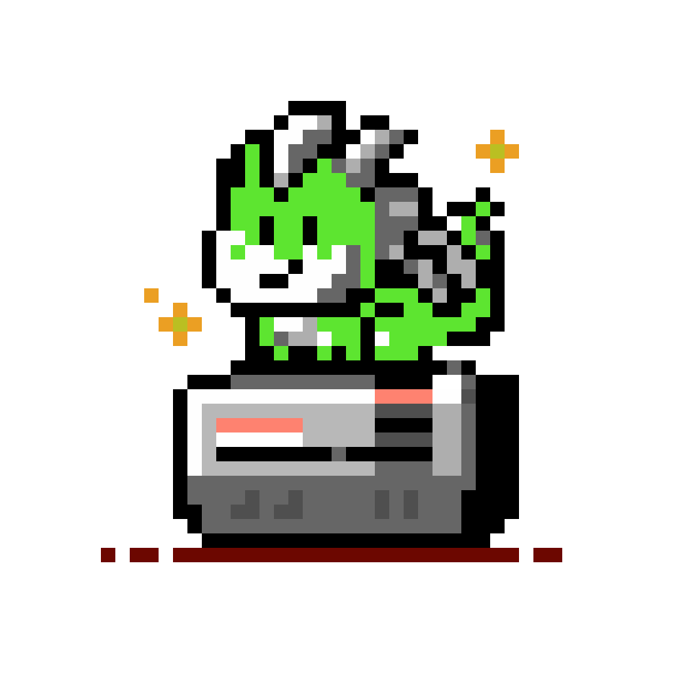

# Nestor - NES emulator

Nestor is a work in progress NES/Famicom emulator written in Go.


- [Nestor - NES emulator](#nestor---nes-emulator)
  - [Build from source](#build-from-source)
    - [Gio](#gio)
    - [Nestor](#nestor)
  - [Usage](#usage)
  - [Contributing to Development](#contributing-to-development)
    - [NES Debugger UI](#nes-debugger-ui)
  - [TODO](#todo)


## Build from source

### Gio

Uses [Gio](gioui.org), a crossplatform GUI for Go, so you first need to install its dependencies.
Please refer to [gioui.org/doc/install](https://gioui.org/doc/install).

### Nestor

Requires at least go1.22

Then you can directly download, build and install `nestor` in your $PATH with:

```
go install github.com/arl/nestor@latest
```

## Usage

```
nestor [options] romfile

Usage of nestor:
  -cpuprofile string
        write cpu profile to file
  -dbg string
        connect to debugger at [host]:port (default: disabled)
  -log string
        enable logging for specified modules (no: disable all logging)
  -reset int
        overwrite CPU reset vector with (-1: rom-defined) (default -1)
  -rominfos
        print infos about the iNes rom and exit
  -trace value
        write cpu trace log to [file|stdout|stderr] (warning: quickly gets very big)
```

## Contributing to Development

### NES Debugger UI

Nestor has a WIP debugger frontend running in the browser. 

To run Nestor in debugging mode, you'd normally do `nestor -dbg=:8000 /path/to/rom`.

But if you actually want to develop the debugger ReactJS app, you'll want to use
`nestor -dbg=:7777 /path/to/rom` instead, since that's the hardcoded address to
use when the fronend end is started with `run npm run start`.


## TODO

 - [x] CPU
 - [x] PPU (background)
 - [x] PPU (sprites)
 - [ ] gamepad/keyboard input
 - [ ] APU (sound)
 - [ ] debugger (WIP)
 - [ ] mappers (currently only NROM works)

