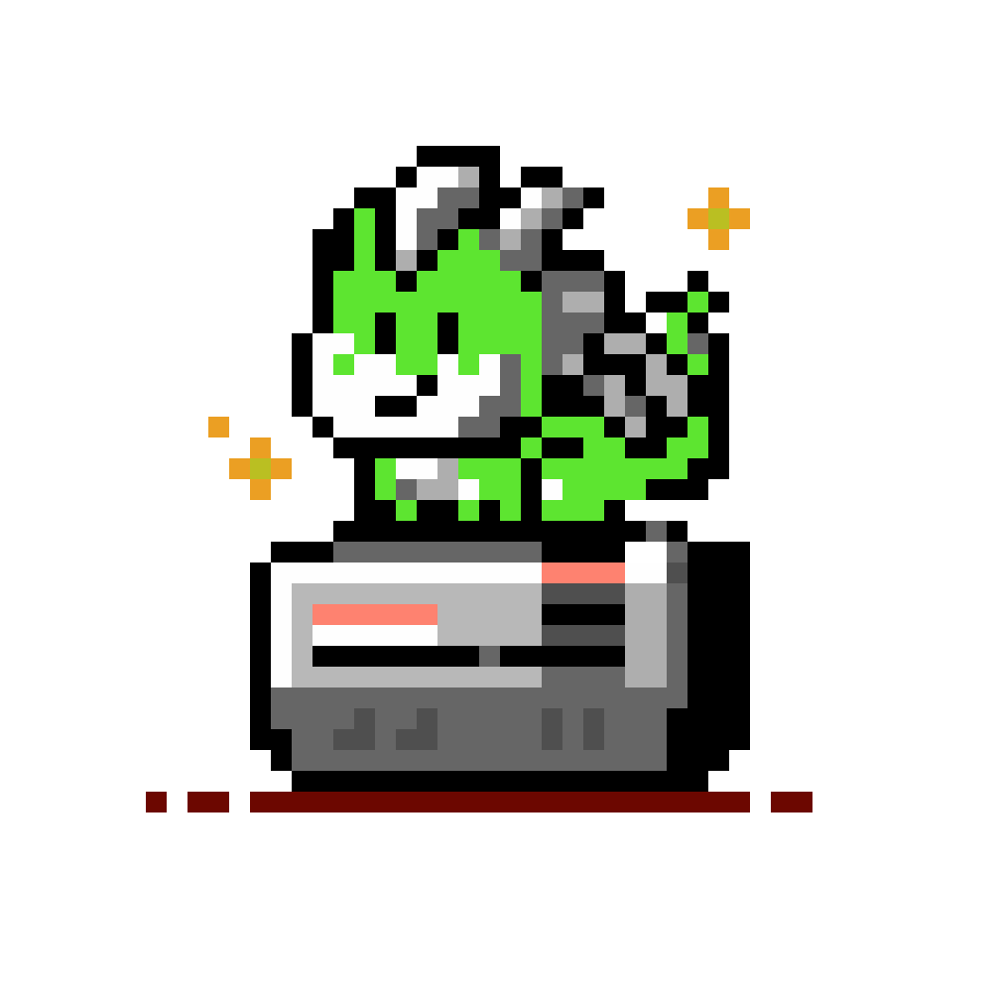

<p align="center">
 
</p>


# Nestor - NES emulator

Nestor is a NES/Famicom emulator written in Go.


- [Nestor - NES emulator](#nestor---nes-emulator)
  - [Features](#features)
    - [Implemented mappers](#implemented-mappers)
  - [Installation](#installation)
    - [MacOS - build from source](#macos---build-from-source)
    - [MacOS - install binary release](#macos---install-binary-release)
    - [Linux - build from source](#linux---build-from-source)
      - [Install dependencies](#install-dependencies)
      - [Build](#build)
  - [Usage](#usage)
  - [License](#license)


## Features

 - [x] Cycle accurate CPU
 - [x] NTSC only (for now)
 - [x] Joystick/Joypad support
 - [x] APU Audio
 - [x] CRT Shader effects
 - [ ] Debugger
 - [ ] Save state
 - [ ] Frame run-ahead
 - [ ] MMC4 + MMC5
 - [ ] Additional mappers

### Implemented mappers

A NES games cartridge is made up of various circuits and hardware, which varies from game to game. The configuraion and capabilities of such cartridges is commonly called their mapper. Mappers are designed to extend the system and bypass its limitations, such as by adding RAM to the cartridge or even extra sound channels.

| Name  | iNES mapper | Implemented |
|-------|------------:|:-----------:|
| NROM  |           0 |     [x]     |
| MMC1  |           1 |     [x]     |
| UxROM |           2 |     [x]     |
| CNROM |           3 |     [x]     |
| MMC4  |           4 |     [ ]     |
| MMC5  |           5 |     [ ]     |
| AxROM |           7 |     [x]     |
| GxROM |          66 |     [x]     |


## Installation

### MacOS - build from source

```
brew install go gtk+3 sdl2 sdl2_ttf
```

Then clone the repository and run:

```
go build
```

### MacOS - install binary release

Install the dependencies
```
brew install gtk+3 sdl2 sdl2_ttf
```

Download the latest binary release for your Mac architecture.


### Linux - build from source

#### Install dependencies

 - debian-based (e.g Ubuntu, Mint)

**todo**

 - other distributions

   - Refer to [github.com/gotk3/gotk3](https://github.com/gotk3/gotk3).

   - SDL: Todo

#### Build

Requires go1.24+

Then you can directly download, build and install `nestor` in your $PATH with:

```
go install github.com/arl/nestor@latest
```

## Usage

You can either directly run a rom file with:

```
$ nestor run /path/to/rom.nes
```

or use the GUI:

```
$ nestor
```

Run `nestor --help` for more information.


## License

Nestor is available under the GPL V3 license.  Full text here: <http://www.gnu.org/licenses/gpl-3.0.en.html>

Copyright (C) 2023-2025 arl

This program is free software: you can redistribute it and/or modify
it under the terms of the GNU General Public License as published by
the Free Software Foundation, either version 3 of the License, or
(at your option) any later version.

This program is distributed in the hope that it will be useful,
but WITHOUT ANY WARRANTY; without even the implied warranty of
MERCHANTABILITY or FITNESS FOR A PARTICULAR PURPOSE.  See the
GNU General Public License for more details.

You should have received a copy of the GNU General Public License
along with this program.  If not, see <http://www.gnu.org/licenses/>.
