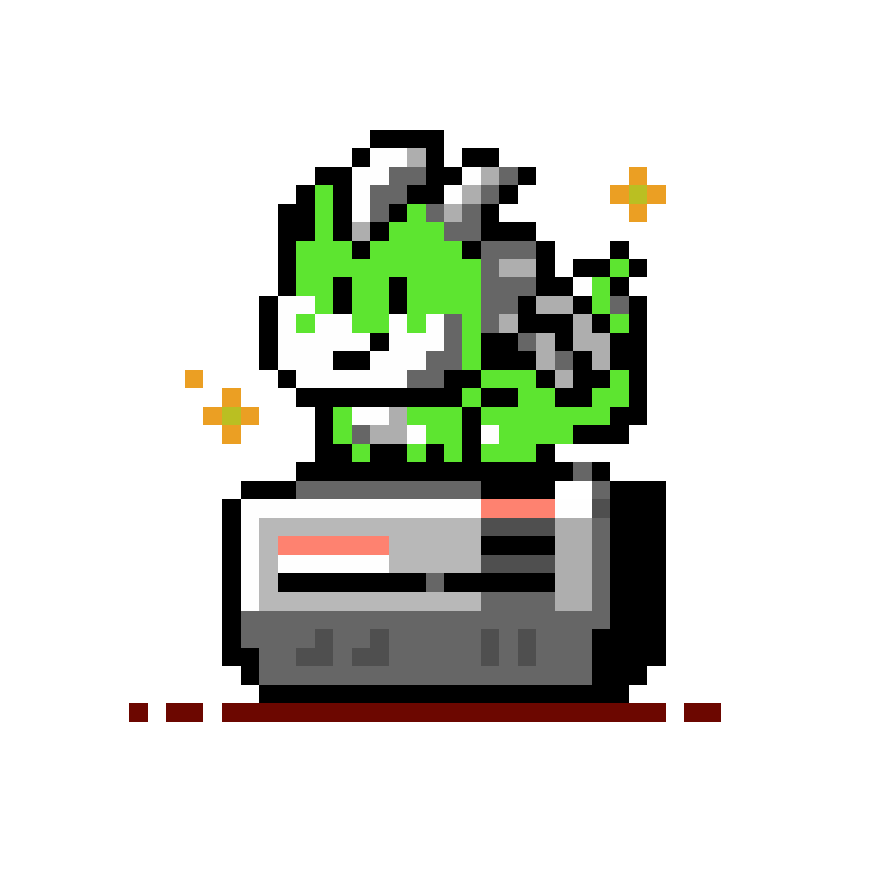
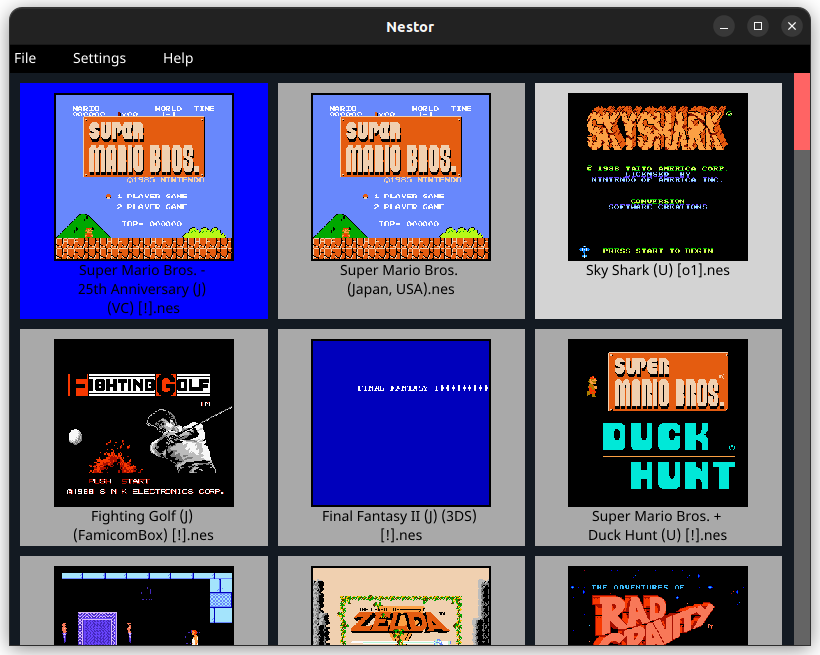
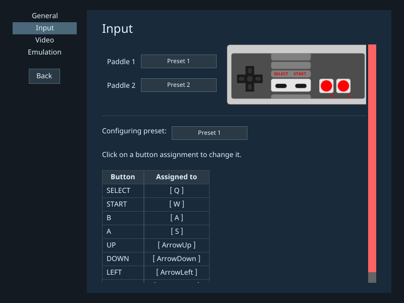
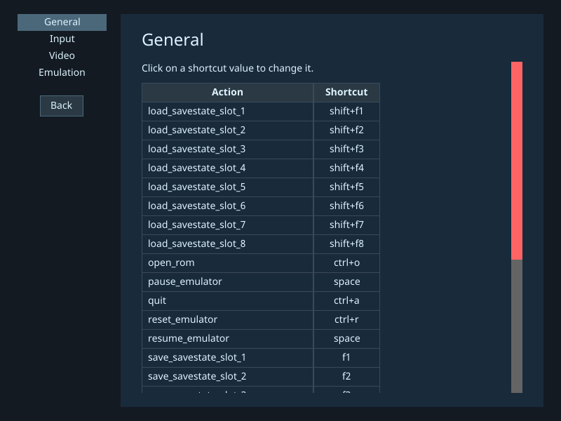
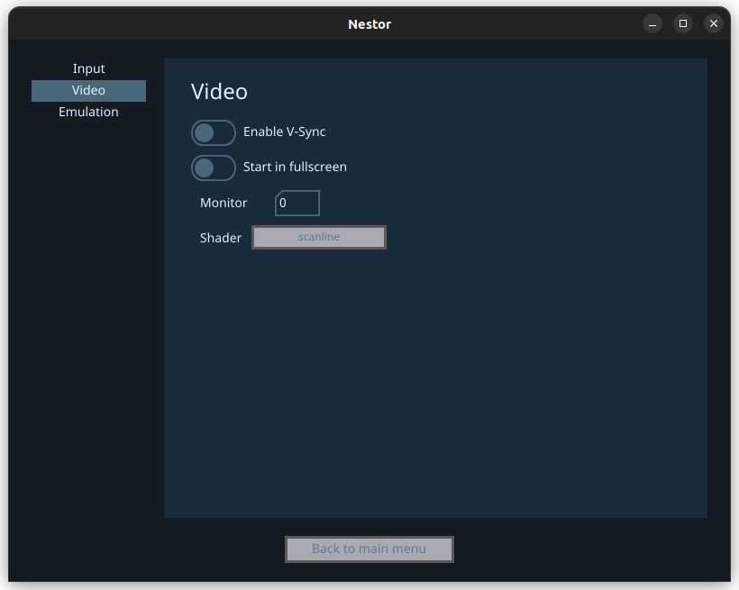

<p align="center">
 
</p>

# Nestor
[](https://github.com/arl/nestor/releases/latest)
[](https://github.com/arl/nestor/actions)
[](https://www.gnu.org/licenses/gpl-3.0)


Nestor is a NES/Famicom emulator.


|  |  |  |
|----|----|----|
|  |  |  |


- [Nestor](#nestor)
  - [Features](#features)
    - [Implemented mappers](#implemented-mappers)
  - [Installation](#installation)
    - [Build from source](#build-from-source)
  - [Usage](#usage)
  - [UI Screenshots](#ui-screenshots)
  - [Thanks](#thanks)
  - [License](#license)


## Features

All these features are planned, but not all of them are implemented yet.

 - [x] Cycle accurate CPU
 - [x] Joystick/Joypad support
 - [x] CRT Shader effects
 - [x] Frame run-ahead
 - [x] NTSC (USA / Japan)
 - [ ] PAL (Europe)
 - [X] Save states


### Implemented mappers

A NES games cartridge is made up of various circuits and hardware, which varies
from game to game. The configuraion and capabilities of such cartridges is
commonly called their mapper. Mappers are designed to extend the system and
bypass its limitations, such as by adding RAM to the cartridge or even extra
sound channels.

|      Name       | iNES mapper | Implemented |
|-----------------|------------:|:-----------:|
| NROM            |           0 |     [x]     |
| MMC1            |           1 |     [x]     |
| UxROM           |           2 |     [x]     |
| CNROM           |           3 |     [x]     |
| MMC3            |           4 |     [ ]     |
| AxROM           |           7 |     [x]     |
| MMC5            |          10 |     [ ]     |
| BNROM           |          34 |     [x]     |
| GxROM           |          66 |     [x]     |


## Installation


### Build from source

 1. Nestor uses the Ebitengine library, which requires some dependencies to be
    installed first. Follow the [Ebitengine installation
    instructions](https://ebitengine.org/en/documents/install.html) for your
    platform.
 2. Install latest Go version, following installation instructions at
    https://go.dev/doc/install (go1.25+ is required).

Now either clone the repository with git:

```
git clone https://github.com/arl/nestor.git
```

then run `go install` in the repository folder.


Or (the go way) simply run:

```
go install github.com/arl/nestor@latest
```

You're good to go, the `nestor` binary should be in your `$GOPATH/bin` folder.

## Usage

You can either directly run a rom file with:

```
$ ./nestor /path/to/rom.nes
```

or start the Graphical User Interface (GUI) mode:

```
$ ./nestor
```

Run `nestor -help` for more options.


## UI Screenshots

|  | 
|:--:| 
| **Rom selection** window |

|  |  |  |
|:--:|:--:|:--:| 
| **Input** config | **Emulation** config | **Video** config |

Upon creation, nestor creates a configuration folder in your home directory:
 - On Linux: `~/.config/nestor/`
 - On MacOS: `~/Library/Application Support/nestor/`
 - On Windows: `%APPDATA%\nestor\`


## Thanks

Many thanks to:
 - @genbs for the help on macos x!
 - @tommyblue for the paddle!
 - @rasky for [ndsemu](https://github.com/rasky/ndsemu) codebase!
 - [NesDev Wifi](https://www.nesdev.org/wiki/Nesdev_Wiki) for the great documentation and community!


## License

Nestor is available under the GPL V3 license.  Full text here: <http://www.gnu.org/licenses/gpl-3.0.en.html>

Copyright (C) 2023-2025 Aurélien Rainone

This program is free software: you can redistribute it and/or modify
it under the terms of the GNU General Public License as published by
the Free Software Foundation, either version 3 of the License, or
(at your option) any later version.

This program is distributed in the hope that it will be useful,
but WITHOUT ANY WARRANTY; without even the implied warranty of
MERCHANTABILITY or FITNESS FOR A PARTICULAR PURPOSE.  See the
GNU General Public License for more details.

You should have received a copy of the GNU General Public License
along with this program.  If not, see <http://www.gnu.org/licenses/>.
